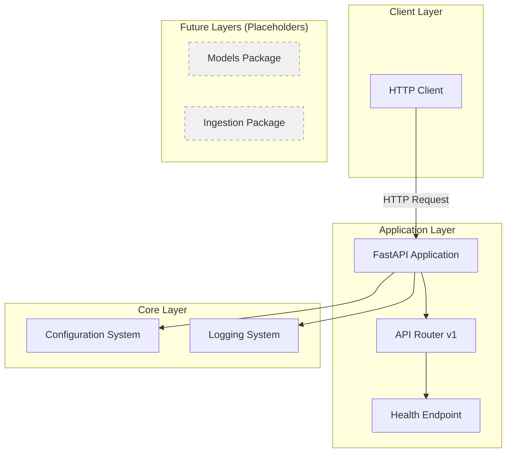
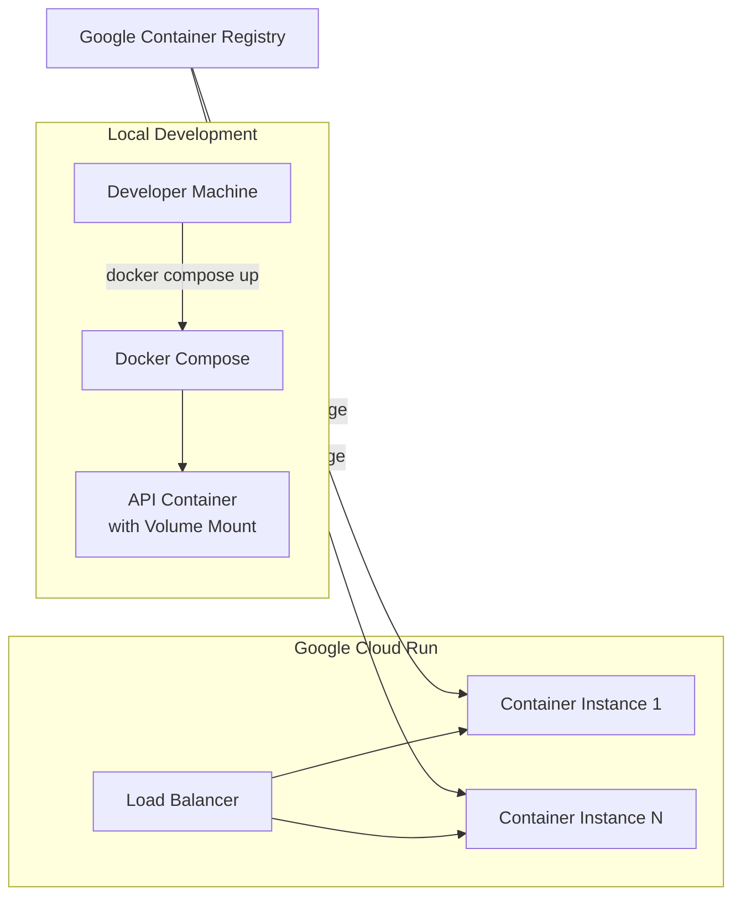

# Design Document: EduScale Engine Infrastructure

## Overview

The EduScale Engine infrastructure establishes a production-ready foundation for a data ingestion and analytics platform. The design follows a modular monolithic architecture using FastAPI as the HTTP server, with clear separation of concerns across API routes, core utilities, business logic, and data models. The system is containerized using Docker with multi-stage builds optimized for Google Cloud Run deployment, while maintaining an excellent local development experience through docker-compose.

The design prioritizes:
- **Simplicity**: Single monolithic application, no microservices complexity
- **Modularity**: Clear package structure enabling future feature additions
- **Production-readiness**: Structured logging, environment-based config, security best practices
- **Developer experience**: Hot reload, easy setup, comprehensive documentation

## Architecture

### High-Level Architecture



### Deployment Architecture



### Package Structure

The application follows a hierarchical package structure:

```
src/eduscale/
├── __init__.py              # Package marker
├── main.py                  # Application entrypoint and factory
├── api/                     # API layer
│   ├── __init__.py
│   └── v1/                  # API version 1
│       ├── __init__.py
│       └── routes_health.py # Health check routes
├── core/                    # Core utilities
│   ├── __init__.py
│   ├── config.py           # Configuration management
│   └── logging.py          # Logging setup
├── models/                  # Data models (placeholder)
│   └── __init__.py
└── ingest/                  # Ingestion logic (placeholder)
    ├── __init__.py
    └── tabular.py          # Tabular data ingestion (placeholder)
```

## Components and Interfaces

### 1. FastAPI Application (`main.py`)

**Responsibility**: Application factory and lifecycle management

**Key Functions**:
- `create_app() -> FastAPI`: Factory function that creates and configures the FastAPI application
- Initializes logging system
- Loads configuration
- Registers API routers
- Returns configured app instance

**Interface**:
```python
# Exported ASGI application
app: FastAPI

# Factory function
def create_app() -> FastAPI:
    """Create and configure the FastAPI application."""
    ...
```

**Design Decisions**:
- Use factory pattern to enable testing with different configurations
- Initialize logging before any other operations
- Keep main.py focused on wiring, not business logic
- Export `app` at module level for ASGI servers (uvicorn, gunicorn)

### 2. Configuration System (`core/config.py`)

**Responsibility**: Centralized configuration management using environment variables

**Key Classes**:
- `Settings(BaseSettings)`: Pydantic settings class with validation

**Configuration Fields**:
```python
class Settings(BaseSettings):
    ENV: str = "local"
    SERVICE_NAME: str = "eduscale-engine"
    SERVICE_VERSION: str = "0.1.0"
    
    # GCP Configuration (placeholders)
    GCP_PROJECT_ID: str = ""
    GCP_REGION: str = "europe-west1"
    GCP_RUN_SERVICE: str = "eduscale-engine"
    
    class Config:
        env_file = ".env"
        case_sensitive = True
```

**Interface**:
```python
# Singleton settings instance
settings: Settings
```

**Design Decisions**:
- Use pydantic BaseSettings for automatic env var loading and validation
- Provide sensible defaults for local development
- Use uppercase field names matching environment variable conventions
- Create singleton instance at module level for easy import
- Support .env file loading for local development

### 3. Logging System (`core/logging.py`)

**Responsibility**: Configure structured logging suitable for Cloud Run

**Key Functions**:
- `setup_logging() -> None`: Configures Python logging with structured output

**Logging Format**:
- Structured format with timestamp, level, logger name, and message
- Output to stdout (Cloud Run requirement)
- JSON-friendly format for log aggregation

**Interface**:
```python
def setup_logging() -> None:
    """Configure structured logging for the application."""
    ...
```

**Design Decisions**:
- Use Python's built-in logging module (no external dependencies)
- Configure at application startup, not import time
- Use structured format compatible with Cloud Logging
- Set appropriate log levels based on environment
- Ensure all logs go to stdout for container environments

### 4. Health Check Endpoint (`api/v1/routes_health.py`)

**Responsibility**: Provide service health and version information

**Routes**:
- `GET /health`: Returns service status

**Response Model**:
```python
{
    "status": "ok",
    "service": "eduscale-engine",
    "version": "0.1.0"
}
```

**Interface**:
```python
router = APIRouter()

@router.get("/health")
async def health_check() -> dict:
    """Health check endpoint."""
    ...
```

**Design Decisions**:
- Use APIRouter for modular route organization
- Return simple JSON response (no complex health checks yet)
- Read service name and version from configuration
- Use async handler for consistency with FastAPI patterns
- Keep endpoint lightweight for frequent health checks

### 5. Docker Container

**Responsibility**: Package application for deployment

**Multi-Stage Build**:

**Stage 1 - Builder**:
- Base: `python:3.11-slim`
- Install build dependencies
- Install Python packages
- Create virtual environment or install to /usr/local

**Stage 2 - Runtime**:
- Base: `python:3.11-slim`
- Copy only necessary artifacts from builder
- Create non-root user (`appuser`)
- Set working directory to `/app`
- Copy source code
- Set environment variables
- Expose PORT (default 8080)
- Run as non-root user
- Execute uvicorn

**Environment Variables**:
- `PYTHONUNBUFFERED=1`: Disable output buffering
- `PORT=8080`: Default port (overridden by Cloud Run)
- `PYTHONDONTWRITEBYTECODE=1`: Prevent .pyc files

**Design Decisions**:
- Multi-stage build reduces final image size
- Non-root user improves security
- Slim base image balances size and functionality
- No-cache-dir pip install reduces image size
- Copy source code last to leverage Docker layer caching
- Use PORT env var for Cloud Run compatibility

### 6. Development Environment (`docker-compose.dev.yml`)

**Responsibility**: Local development environment with hot reload

**Services**:

**api**:
- Build context: Project root
- Dockerfile: `docker/Dockerfile`
- Ports: `8000:8000`
- Volumes: `../src:/app/src` (source code mount)
- Environment: Load from `.env` file
- Command override: `uvicorn eduscale.main:app --reload --host 0.0.0.0 --port 8000`

**Design Decisions**:
- Mount source directory for live code reloading
- Override command to enable --reload flag
- Use same Dockerfile as production (consistency)
- Map to port 8000 locally (8080 reserved for production)
- Load environment from .env file
- Single service (no database yet)

## Data Models

### Health Response Model

```python
{
    "status": str,      # Always "ok" for successful response
    "service": str,     # Service name from configuration
    "version": str      # Service version from configuration
}
```

**Validation**: None required at this stage (simple dict response)

**Future Considerations**: 
- Add pydantic response models when API grows
- Include additional health metrics (database connectivity, etc.)

## Error Handling

### Application-Level Errors

**Strategy**: Let FastAPI handle errors with default handlers

**HTTP Error Responses**:
- 404: Route not found (FastAPI default)
- 500: Internal server error (FastAPI default)
- 422: Validation error (FastAPI default)

**Logging**:
- Log all unhandled exceptions at ERROR level
- Include request context in error logs

**Future Enhancements**:
- Custom exception handlers for domain-specific errors
- Structured error responses with error codes
- Request ID tracking for debugging

### Container-Level Errors

**Strategy**: Fail fast and let orchestrator restart

**Startup Failures**:
- Exit with non-zero code if configuration invalid
- Exit if critical dependencies unavailable
- Cloud Run will restart container automatically

**Runtime Failures**:
- Log error and return 500 response
- Container stays running (transient errors)
- Cloud Run health checks detect persistent failures

## Testing Strategy

### Unit Tests

**Scope**: Individual functions and classes

**Approach**:
- Test configuration loading with different env vars
- Test logging setup
- Test health endpoint response format

**Tools**:
- pytest: Test runner
- FastAPI TestClient: HTTP testing

**Example Test Structure**:
```python
def test_health_endpoint():
    """Test health endpoint returns correct response."""
    client = TestClient(app)
    response = client.get("/health")
    
    assert response.status_code == 200
    data = response.json()
    assert data["status"] == "ok"
    assert "service" in data
    assert "version" in data
```

### Integration Tests

**Scope**: Not required at this stage (no external dependencies)

**Future**: Test interactions with BigQuery, Cloud Storage, etc.

### Container Tests

**Scope**: Verify container builds and runs

**Approach**:
- Build Docker image locally
- Run container and verify health endpoint responds
- Check logs for errors

**Manual Verification**:
```bash
docker build -f docker/Dockerfile -t eduscale-engine:test .
docker run -p 8080:8080 eduscale-engine:test
curl http://localhost:8080/health
```

### Local Development Testing

**Approach**:
- Run with docker-compose
- Verify hot reload works
- Test health endpoint
- Check logs appear correctly

**Commands**:
```bash
docker compose -f docker/docker-compose.dev.yml up --build
curl http://localhost:8000/health
# Make code change and verify reload
```

## Configuration Management

### Environment Variables

**Loading Priority**:
1. System environment variables (highest)
2. `.env` file in project root
3. Default values in Settings class (lowest)

**Required Variables**: None (all have defaults)

**Optional Variables**:
- `ENV`: Environment name (local, dev, prod)
- `SERVICE_NAME`: Override service name
- `SERVICE_VERSION`: Override version
- `GCP_PROJECT_ID`: GCP project for deployment
- `GCP_REGION`: GCP region for deployment

### Secrets Management

**Current Stage**: No secrets required

**Future Considerations**:
- Use Google Secret Manager for production secrets
- Never commit secrets to repository
- Use separate .env files per environment
- Document secret requirements in README

## Deployment

### Local Deployment

**Without Docker**:
```bash
python -m venv .venv
source .venv/bin/activate
pip install -r requirements.txt
uvicorn eduscale.main:app --reload --host 0.0.0.0 --port 8000
```

**With Docker Compose**:
```bash
cd docker
docker compose -f docker-compose.dev.yml up --build
```

### Cloud Run Deployment

**Prerequisites**:
- GCP project created
- gcloud CLI installed and authenticated
- Container image pushed to GCR or Artifact Registry

**Build and Push**:
```bash
docker build -f docker/Dockerfile -t gcr.io/$GCP_PROJECT_ID/eduscale-engine:latest .
docker push gcr.io/$GCP_PROJECT_ID/eduscale-engine:latest
```

**Deploy**:
```bash
gcloud run deploy eduscale-engine \
  --image=gcr.io/$GCP_PROJECT_ID/eduscale-engine:latest \
  --region=europe-west1 \
  --platform=managed \
  --allow-unauthenticated \
  --port=8080
```

**Environment Variables** (set during deployment):
```bash
gcloud run deploy eduscale-engine \
  --set-env-vars ENV=prod,SERVICE_VERSION=0.1.0
```

### CI/CD Considerations (Future)

**Not implemented in this stage**, but recommended approach:
- GitHub Actions or Cloud Build for CI
- Automated testing on PR
- Automated deployment on merge to main
- Separate environments (dev, staging, prod)

## Security Considerations

### Container Security

- Run as non-root user (appuser)
- Use slim base images (reduced attack surface)
- No unnecessary packages installed
- Regular base image updates

### Application Security

- No authentication required yet (public health endpoint)
- CORS not configured (add when frontend added)
- No sensitive data in logs
- Environment variables for configuration (no hardcoded values)

### Future Security Requirements

- Add authentication/authorization when data endpoints added
- Implement rate limiting
- Add request validation
- Enable HTTPS only (Cloud Run provides this)
- Implement audit logging

## Performance Considerations

### Application Performance

- Async handlers for I/O operations
- Lightweight health endpoint (no database queries)
- Fast startup time (< 5 seconds)

### Container Performance

- Small image size (< 500MB)
- Fast build time with layer caching
- Minimal runtime dependencies

### Cloud Run Scaling

- Cold start time: < 5 seconds (target)
- Minimum instances: 0 (cost optimization)
- Maximum instances: 10 (initial limit)
- Concurrency: 80 (Cloud Run default)

## Monitoring and Observability

### Logging

- All logs to stdout
- Structured log format
- Log levels: DEBUG, INFO, WARNING, ERROR
- Cloud Logging automatic ingestion

### Metrics (Future)

- Request count
- Response time
- Error rate
- Container resource usage

### Tracing (Future)

- Request tracing with Cloud Trace
- Distributed tracing when microservices added

## Future Extensibility

### Planned Features (Not Implemented)

The architecture supports future additions:

1. **File Upload API**:
   - Add routes in `api/v1/routes_upload.py`
   - Add file handling in `ingest/` package
   - Add Cloud Storage client in `core/`

2. **ML Models**:
   - Add model definitions in `models/`
   - Add model loading in startup
   - Add inference endpoints in `api/v1/`

3. **BigQuery Integration**:
   - Add BigQuery client in `core/`
   - Add query builders in `ingest/`
   - Add data models in `models/`

4. **NL to SQL**:
   - Add LLM client in `core/`
   - Add SQL generation in new package
   - Add query execution endpoints

### Extension Points

- **API Versioning**: v1 structure allows v2 addition
- **Package Structure**: Clear separation for new features
- **Configuration**: Easy to add new settings
- **Logging**: Structured format supports additional fields
- **Docker**: Multi-stage build supports additional dependencies

## Technology Choices and Rationale

### FastAPI
- **Why**: Modern, fast, automatic API documentation, async support
- **Alternatives considered**: Flask (less modern), Django (too heavy)

### Pydantic
- **Why**: Data validation, settings management, type safety
- **Alternatives considered**: python-decouple (less powerful)

### Docker Multi-Stage Build
- **Why**: Smaller images, better security, faster deployments
- **Alternatives considered**: Single-stage (larger images)

### Cloud Run
- **Why**: Serverless, auto-scaling, pay-per-use, managed infrastructure
- **Alternatives considered**: GKE (more complex), Compute Engine (less managed)

### Python 3.11
- **Why**: Latest stable, performance improvements, modern syntax
- **Alternatives considered**: 3.10 (slightly older), 3.12 (too new)

## Risks and Mitigations

### Risk: Cold Start Latency
- **Impact**: First request after idle period may be slow
- **Mitigation**: Keep image small, optimize startup, consider min instances

### Risk: Configuration Errors
- **Impact**: Application fails to start or behaves incorrectly
- **Mitigation**: Pydantic validation, clear error messages, documentation

### Risk: Docker Build Failures
- **Impact**: Cannot deploy application
- **Mitigation**: Test builds locally, use CI/CD, pin dependency versions

### Risk: Port Configuration Mismatch
- **Impact**: Cloud Run cannot route traffic to container
- **Mitigation**: Use PORT env var, test locally, document requirements

## Success Criteria

The infrastructure is successful if:

1. ✅ Developer can clone repo and run locally in < 5 minutes
2. ✅ Health endpoint responds with correct JSON
3. ✅ Tests pass with pytest
4. ✅ Docker image builds successfully
5. ✅ Container runs on Cloud Run
6. ✅ Hot reload works in development
7. ✅ Logs appear in Cloud Logging
8. ✅ Code is modular and extensible
9. ✅ Documentation is clear and complete
10. ✅ No security vulnerabilities in dependencies
