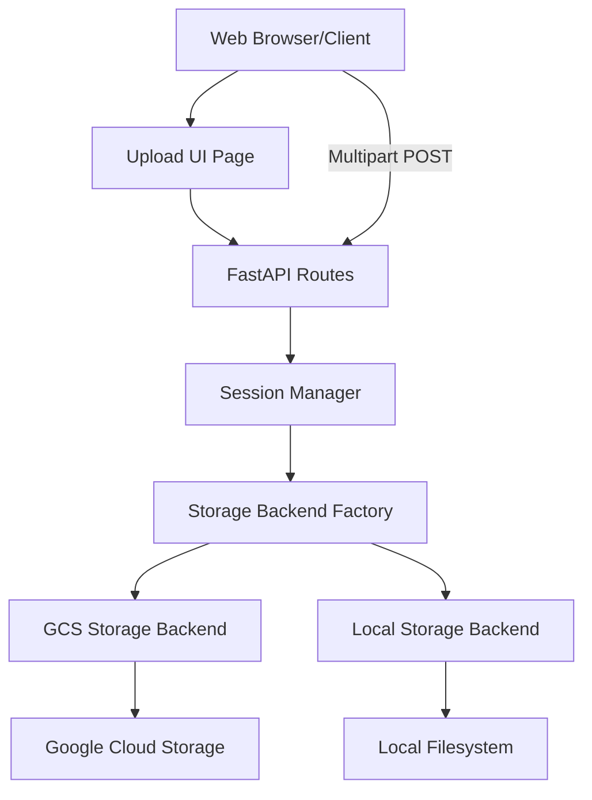

# Design Document

## Overview

The File Upload Module extends the EduScale Engine with a dual-mode file upload system that supports both Google Cloud Storage (GCS) for production deployments and local filesystem storage for development. The design follows a modular architecture with clear separation between HTTP handling, storage backends, and session management.

The system implements a single-request upload pattern where the client sends the file and metadata together. The server validates the request, generates a unique file ID, routes the file to the appropriate storage backend (GCS or local), and returns the upload result.

This design provides the simplest possible client experience while the server handles validation, storage routing, and tracking transparently.

## Architecture

### High-Level Component Diagram



### Request Flow

**Single-Request Upload (Both GCS and Local Mode):**

1. Client calls `POST /api/v1/upload` with multipart/form-data containing file and region_id
2. API validates request (size, MIME type, region_id)
3. API generates unique file_id (UUID4)
4. API routes file to appropriate storage backend:
   - **GCS Mode**: API streams file to Google Cloud Storage
   - **Local Mode**: API streams file to local filesystem
5. API records upload metadata in Upload Store
6. API returns success response with file_id and storage information

## Components and Interfaces

### 1. Configuration Extension (`eduscale.core.config`)

Extend the existing `Settings` class with upload-specific configuration:

```python
class Settings(BaseSettings):
    # ... existing fields ...
    
    # Storage Configuration
    STORAGE_BACKEND: str = "local"  # "gcs" or "local"
    GCS_BUCKET_NAME: str = ""
    
    # Upload Constraints
    MAX_UPLOAD_MB: int = 50
    ALLOWED_UPLOAD_MIME_TYPES: str = ""  # Comma-separated, empty = allow all
    
    @property
    def allowed_mime_types(self) -> list[str] | None:
        """Parse ALLOWED_UPLOAD_MIME_TYPES into a list."""
        if not self.ALLOWED_UPLOAD_MIME_TYPES:
            return None
        return [mt.strip() for mt in self.ALLOWED_UPLOAD_MIME_TYPES.split(",")]
    
    @property
    def max_upload_bytes(self) -> int:
        """Convert MAX_UPLOAD_MB to bytes."""
        return self.MAX_UPLOAD_MB * 1024 * 1024
```

### 2. Data Models (`eduscale.models.upload`)

Define Pydantic models for response validation:

```python
from pydantic import BaseModel
from datetime import datetime

class UploadResponse(BaseModel):
    """Response model for file upload."""
    file_id: str
    file_name: str
    storage_backend: str
    storage_path: str
    region_id: str
    content_type: str
    size_bytes: int
    created_at: datetime
```

### 3. Upload Store (`eduscale.storage.upload_store`)

In-memory upload tracking with future database migration path:

```python
from dataclasses import dataclass
from datetime import datetime
from typing import Dict, Optional

@dataclass
class UploadRecord:
    """Upload record metadata."""
    file_id: str
    region_id: str
    file_name: str
    content_type: str
    size_bytes: int
    storage_backend: str
    storage_path: str
    created_at: datetime

class UploadStore:
    """In-memory store for upload records."""
    
    def __init__(self):
        self._uploads: Dict[str, UploadRecord] = {}
    
    def create(self, record: UploadRecord) -> None:
        """Store a new upload record."""
        self._uploads[record.file_id] = record
    
    def get(self, file_id: str) -> Optional[UploadRecord]:
        """Retrieve an upload record by file_id."""
        return self._uploads.get(file_id)
    
    def list_all(self) -> list[UploadRecord]:
        """List all upload records."""
        return list(self._uploads.values())

# Singleton instance
upload_store = UploadStore()
```


### 4. Storage Backend Interface (`eduscale.storage.base`)

Abstract interface for storage backends:

```python
from abc import ABC, abstractmethod
from typing import Tuple

class StorageBackend(ABC):
    """Abstract base class for storage backends."""
    
    @abstractmethod
    def get_target_path(
        self,
        file_id: str,
        file_name: str
    ) -> str:
        """Generate target storage path.
        
        Returns:
            Target path for the file
        """
        pass
    
    @abstractmethod
    async def store_file(
        self,
        file_id: str,
        file_name: str,
        content_type: str,
        file_data: BinaryIO
    ) -> str:
        """Store uploaded file to backend.
        
        Returns:
            Final storage path
        """
        pass
    
    @abstractmethod
    def get_backend_name(self) -> str:
        """Return backend identifier."""
        pass
```

### 5. GCS Storage Backend (`eduscale.storage.gcs`)

Google Cloud Storage implementation:

```python
from google.cloud import storage
from datetime import timedelta
from eduscale.core.config import settings
from eduscale.storage.base import StorageBackend

class GCSStorageBackend(StorageBackend):
    """Google Cloud Storage backend."""
    
    def __init__(self):
        self._client: Optional[storage.Client] = None
        self._bucket: Optional[storage.Bucket] = None
    
    def _get_bucket(self) -> storage.Bucket:
        """Lazy-load and cache GCS bucket."""
        if self._bucket is None:
            if not settings.GCS_BUCKET_NAME:
                raise ValueError("GCS_BUCKET_NAME not configured")
            
            self._client = storage.Client(project=settings.GCP_PROJECT_ID)
            self._bucket = self._client.bucket(settings.GCS_BUCKET_NAME)
        
        return self._bucket
    
    def get_target_path(self, file_id: str, file_name: str) -> str:
        """Generate GCS target path."""
        safe_name = self._sanitize_filename(file_name)
        blob_path = f"raw/{file_id}/{safe_name}"
        return f"gs://{settings.GCS_BUCKET_NAME}/{blob_path}"
    
    async def store_file(
        self,
        file_id: str,
        file_name: str,
        content_type: str,
        file_data: BinaryIO
    ) -> str:
        """Upload file to GCS."""
        bucket = self._get_bucket()
        
        safe_name = self._sanitize_filename(file_name)
        blob_path = f"raw/{file_id}/{safe_name}"
        blob = bucket.blob(blob_path)
        
        # Stream upload in chunks
        blob.content_type = content_type
        blob.upload_from_file(file_data, rewind=True)
        
        return f"gs://{settings.GCS_BUCKET_NAME}/{blob_path}"
    
    def get_backend_name(self) -> str:
        return "gcs"
    
    @staticmethod
    def _sanitize_filename(filename: str) -> str:
        """Remove path traversal and dangerous characters."""
        import re
        safe = filename.replace("../", "").replace("..\\", "")
        safe = safe.replace("/", "_").replace("\\", "_")
        safe = re.sub(r'[^a-zA-Z0-9._-]', '_', safe)
        return safe[:255]

# Singleton instance
gcs_backend = GCSStorageBackend()
```

### 6. Local Storage Backend (`eduscale.storage.local`)

Local filesystem implementation:

```python
from pathlib import Path
from eduscale.core.config import settings
from eduscale.storage.base import StorageBackend

class LocalStorageBackend(StorageBackend):
    """Local filesystem storage backend."""
    
    def __init__(self):
        self.base_path = Path("data/uploads/raw")
    
    def get_target_path(self, file_id: str, file_name: str) -> str:
        """Generate local target path."""
        safe_name = self._sanitize_filename(file_name)
        target_path = self.base_path / file_id / safe_name
        return str(target_path)
    
    async def store_file(
        self,
        file_id: str,
        file_name: str,
        content_type: str,
        file_data: BinaryIO
    ) -> str:
        """Write file to local filesystem."""
        safe_name = self._sanitize_filename(file_name)
        target_path = self.base_path / file_id / safe_name
        
        # Create directory if needed
        target_path.parent.mkdir(parents=True, exist_ok=True)
        
        # Stream write in chunks
        with open(target_path, 'wb') as f:
            while chunk := file_data.read(65536):  # 64KB chunks
                f.write(chunk)
        
        return str(target_path)
    
    def get_backend_name(self) -> str:
        return "local"
    
    @staticmethod
    def _sanitize_filename(filename: str) -> str:
        """Remove path traversal and dangerous characters."""
        import re
        safe = filename.replace("../", "").replace("..\\", "")
        safe = safe.replace("/", "_").replace("\\", "_")
        safe = re.sub(r'[^a-zA-Z0-9._-]', '_', safe)
        return safe[:255]

# Singleton instance
local_backend = LocalStorageBackend()
```

### 7. Storage Factory (`eduscale.storage.factory`)

Factory to select appropriate backend:

```python
from eduscale.core.config import settings
from eduscale.storage.base import StorageBackend
from eduscale.storage.gcs import gcs_backend
from eduscale.storage.local import local_backend

def get_storage_backend() -> StorageBackend:
    """Return the configured storage backend."""
    if settings.STORAGE_BACKEND == "gcs":
        return gcs_backend
    elif settings.STORAGE_BACKEND == "local":
        return local_backend
    else:
        raise ValueError(f"Unknown storage backend: {settings.STORAGE_BACKEND}")
```


### 8. Upload Routes (`eduscale.api.v1.routes_upload`)

FastAPI router for upload endpoint:

```python
from fastapi import APIRouter, HTTPException, UploadFile, File, Form
from uuid import uuid4
from datetime import datetime
import logging

from eduscale.core.config import settings
from eduscale.models.upload import UploadResponse
from eduscale.storage.factory import get_storage_backend
from eduscale.storage.upload_store import upload_store, UploadRecord

router = APIRouter(prefix="/api/v1", tags=["upload"])
logger = logging.getLogger(__name__)

@router.post("/upload", response_model=UploadResponse, status_code=201)
async def upload_file(
    file: UploadFile = File(...),
    region_id: str = Form(...)
):
    """Upload a file with metadata."""
    # Validate region_id
    # Validate file size
    # Validate MIME type
    # Generate file_id
    # Get storage backend
    # Stream file to backend (GCS or local)
    # Create upload record
    # Return response
    pass
```

### 9. Upload UI (`eduscale.ui.templates.upload`)

Simple Jinja2 template with inline JavaScript:

```html
<!DOCTYPE html>
<html>
<head>
    <title>EduScale File Upload</title>
    <style>
        body { font-family: Arial, sans-serif; max-width: 600px; margin: 50px auto; }
        .form-group { margin-bottom: 15px; }
        label { display: block; margin-bottom: 5px; font-weight: bold; }
        input, select { width: 100%; padding: 8px; }
        button { padding: 10px 20px; background: #007bff; color: white; border: none; cursor: pointer; }
        #status { margin-top: 20px; padding: 10px; border: 1px solid #ddd; min-height: 100px; }
    </style>
</head>
<body>
    <h1>Upload File</h1>
    <form id="uploadForm">
        <div class="form-group">
            <label>Region:</label>
            <select id="regionId" required>
                <option value="eu-west">EU West</option>
                <option value="us-east">US East</option>
                <option value="asia-pacific">Asia Pacific</option>
            </select>
        </div>
        <div class="form-group">
            <label>File:</label>
            <input type="file" id="fileInput" required />
        </div>
        <button type="submit">Upload</button>
    </form>
    <div id="status"></div>
    
    <script>
        // Upload logic with fetch API
        // 1. Create FormData with file and region_id
        // 2. POST to /api/v1/upload
        // 3. Display result
    </script>
</body>
</html>
```

### 10. UI Route Handler (`eduscale.api.v1.routes_ui`)

Serve the upload page:

```python
from fastapi import APIRouter, Request
from fastapi.responses import HTMLResponse
from fastapi.templating import Jinja2Templates

router = APIRouter()
templates = Jinja2Templates(directory="src/eduscale/ui/templates")

@router.get("/upload", response_class=HTMLResponse)
async def upload_page(request: Request):
    """Serve the upload UI page."""
    return templates.TemplateResponse("upload.html", {"request": request})
```

## Data Models

### Upload Store Schema

```
UploadRecord {
    file_id: UUID (primary key)
    region_id: string
    file_name: string
    content_type: string
    size_bytes: integer
    storage_backend: "gcs" | "local"
    storage_path: string
    created_at: datetime
}
```

### File Storage Paths

**GCS Mode:**
- Pattern: `gs://{bucket}/raw/{file_id}/{sanitized_filename}`
- Example: `gs://eduscale-uploads/raw/a1b2c3d4-e5f6-7890-abcd-ef1234567890/report.csv`

**Local Mode:**
- Pattern: `data/uploads/raw/{file_id}/{sanitized_filename}`
- Example: `data/uploads/raw/a1b2c3d4-e5f6-7890-abcd-ef1234567890/report.csv`

## Error Handling

### Validation Errors (HTTP 400)

- Empty or missing `region_id`
- File size exceeds `MAX_UPLOAD_MB`
- Content type not in `ALLOWED_UPLOAD_MIME_TYPES` (when configured)
- Invalid file_id in local upload request

### Configuration Errors (HTTP 500)

- `STORAGE_BACKEND="gcs"` but `GCS_BUCKET_NAME` not set
- GCS authentication failure
- Local filesystem write permission denied

### Error Response Format

```json
{
    "detail": "Human-readable error message"
}
```

### Logging Strategy

- **INFO**: Session creation, upload completion
- **WARNING**: Validation failures, rejected uploads
- **ERROR**: Configuration errors, storage failures, unexpected exceptions

All logs use structured logging from `eduscale.core.logging`.


## Testing Strategy

### Unit Tests

**Configuration Tests** (`tests/test_config.py`):
- Verify `allowed_mime_types` property parsing
- Verify `max_upload_bytes` calculation
- Test default values

**Upload Store Tests** (`tests/test_upload_store.py`):
- Test upload record creation and retrieval
- Test listing all uploads
- Test missing record handling

**Storage Backend Tests** (`tests/test_storage_backends.py`):
- Test filename sanitization
- Test path generation
- Mock GCS client for signed URL generation
- Test local path construction

### Integration Tests

**Upload Endpoint Tests** (`tests/test_upload.py`):
- Test `POST /api/v1/upload` with valid file and region_id
- Test validation errors (oversized, invalid MIME, empty region)
- Test response structure in both GCS and local modes
- Mock storage backends to avoid external dependencies
- Test file streaming and storage
- Verify upload record creation

**UI Tests** (`tests/test_ui.py`):
- Test `GET /upload` returns HTML
- Verify template rendering

### Test Configuration

Use `pytest` with fixtures for:
- FastAPI `TestClient`
- Temporary directories for local storage tests
- Mocked GCS client
- Override settings for test isolation

Example fixture:

```python
import pytest
from fastapi.testclient import TestClient
from eduscale.main import app
from eduscale.core.config import settings

@pytest.fixture
def client():
    return TestClient(app)

@pytest.fixture
def local_storage_settings(monkeypatch):
    monkeypatch.setattr(settings, "STORAGE_BACKEND", "local")
    monkeypatch.setattr(settings, "MAX_UPLOAD_MB", 10)
    monkeypatch.setattr(settings, "ALLOWED_UPLOAD_MIME_TYPES", "text/csv")
```

### Manual Testing Checklist

- [ ] Upload CSV file in local mode
- [ ] Upload audio file in local mode
- [ ] Verify file appears in `data/uploads/raw/{file_id}/`
- [ ] Test oversized file rejection
- [ ] Test invalid MIME type rejection
- [ ] Configure GCS mode and test signed URL generation
- [ ] Verify GCS upload completes successfully
- [ ] Test UI in both storage modes

## Infrastructure Requirements

### Terraform Configuration

Add GCS bucket resource to `infra/terraform/main.tf`:

```hcl
# Enable Cloud Storage API
resource "google_project_service" "storage" {
  project = var.project_id
  service = "storage.googleapis.com"
  disable_on_destroy = false
}

# GCS Bucket for File Uploads
resource "google_storage_bucket" "uploads" {
  name          = "${var.project_id}-eduscale-uploads"
  location      = var.region
  force_destroy = false
  
  uniform_bucket_level_access = true
  
  lifecycle_rule {
    condition {
      age = 90
    }
    action {
      type = "Delete"
    }
  }
  
  versioning {
    enabled = false
  }
  
  depends_on = [google_project_service.storage]
}

# Grant Cloud Run service account access to bucket
resource "google_storage_bucket_iam_member" "cloud_run_object_admin" {
  bucket = google_storage_bucket.uploads.name
  role   = "roles/storage.objectAdmin"
  member = "serviceAccount:${google_cloud_run_v2_service.eduscale_engine.template[0].service_account}"
}
```

Add variable to `infra/terraform/variables.tf`:

```hcl
variable "uploads_bucket_lifecycle_days" {
  description = "Number of days before uploaded files are deleted"
  type        = number
  default     = 90
}
```

Add output to `infra/terraform/outputs.tf`:

```hcl
output "uploads_bucket_name" {
  description = "Name of the GCS bucket for file uploads"
  value       = google_storage_bucket.uploads.name
}
```

### Cloud Run Environment Variables

Update `infra/terraform/main.tf` to add environment variables to Cloud Run:

```hcl
env {
  name  = "STORAGE_BACKEND"
  value = "gcs"
}

env {
  name  = "GCS_BUCKET_NAME"
  value = google_storage_bucket.uploads.name
}

env {
  name  = "MAX_UPLOAD_MB"
  value = "50"
}

env {
  name  = "ALLOWED_UPLOAD_MIME_TYPES"
  value = "text/csv,application/vnd.openxmlformats-officedocument.spreadsheetml.sheet,application/json,audio/mpeg,audio/wav"
}
```

### Python Dependencies

Add to `requirements.txt`:

```
google-cloud-storage>=2.10.0
jinja2>=3.1.0
python-multipart>=0.0.6
```

## Security Considerations

### Input Validation

- **File Size**: Enforce `MAX_UPLOAD_MB` at session creation and during local upload
- **MIME Types**: Whitelist allowed content types via `ALLOWED_UPLOAD_MIME_TYPES`
- **Region ID**: Validate length and format to prevent injection attacks
- **File Names**: Sanitize to remove path traversal sequences (`../`, `..\\`)

### Path Traversal Prevention

- Always prepend UUID-based directory (`file_id`) to file paths
- Sanitize file names to remove directory separators
- Use `pathlib.Path` for safe path construction
- Never trust client-provided paths directly

### GCS Security

- Use V4 signed URLs with 15-minute expiration
- Include content type in signed URL to prevent MIME confusion
- Grant minimal IAM permissions (objectAdmin on specific bucket)
- Enable uniform bucket-level access

### Local Storage Security

- Store files outside web-accessible directories
- Validate file_id exists in session store before accepting uploads
- Stream files in chunks to prevent memory exhaustion
- Set appropriate filesystem permissions on upload directory

### Error Message Safety

- Return generic error messages to clients (HTTP 500)
- Log detailed error information server-side only
- Never expose internal paths or configuration in responses

## Performance Considerations

### GCS Mode Advantages

- Automatic redundancy and durability
- Scalable storage without disk space concerns
- Suitable for production multi-instance deployments
- Built-in lifecycle management

### Local Mode Limitations

- Disk space limited to container/VM storage
- Not suitable for multi-instance deployments without shared filesystem
- Intended for development and testing only

### API Bandwidth Considerations

- API server handles all file uploads in both modes
- Use streaming to minimize memory usage
- Consider Cloud Run request timeout limits (up to 60 minutes for 2nd gen)
- For very large files (>100MB), consider implementing resumable uploads in future

### Optimization Strategies

- Lazy-load GCS client (initialize on first use)
- Reuse GCS client and bucket objects across requests
- Stream uploads in 64KB chunks to limit memory usage
- Use async handlers where possible to avoid blocking
- Consider implementing upload progress tracking for large files

## Migration Path

### Phase 1: In-Memory Upload Store (Current Design)

- Simple dictionary-based storage
- Suitable for single-instance deployments
- Upload records lost on restart

### Phase 2: Database-Backed Upload Records (Future)

- Replace `UploadStore` with database repository
- Use PostgreSQL or Cloud SQL
- Add upload history queries and analytics
- Support multi-instance deployments

### Phase 3: Event-Driven Processing (Future)

- Emit events on upload completion
- Trigger downstream ingestion pipelines
- Add webhook notifications
- Integrate with Cloud Pub/Sub

## Deployment Workflow

1. **Update Terraform**: Apply infrastructure changes to provision GCS bucket
2. **Update Dependencies**: Install new Python packages
3. **Configure Environment**: Set `STORAGE_BACKEND=gcs` and `GCS_BUCKET_NAME`
4. **Deploy Application**: Build and deploy updated container to Cloud Run
5. **Verify**: Test upload flow via UI and API

## Open Questions and Future Enhancements

- Should we support resumable uploads for large files?
- Do we need upload progress tracking?
- Should sessions expire after a certain time?
- Do we need to support multiple files per session?
- Should we add virus scanning integration?
- Do we need audit logging for compliance?
